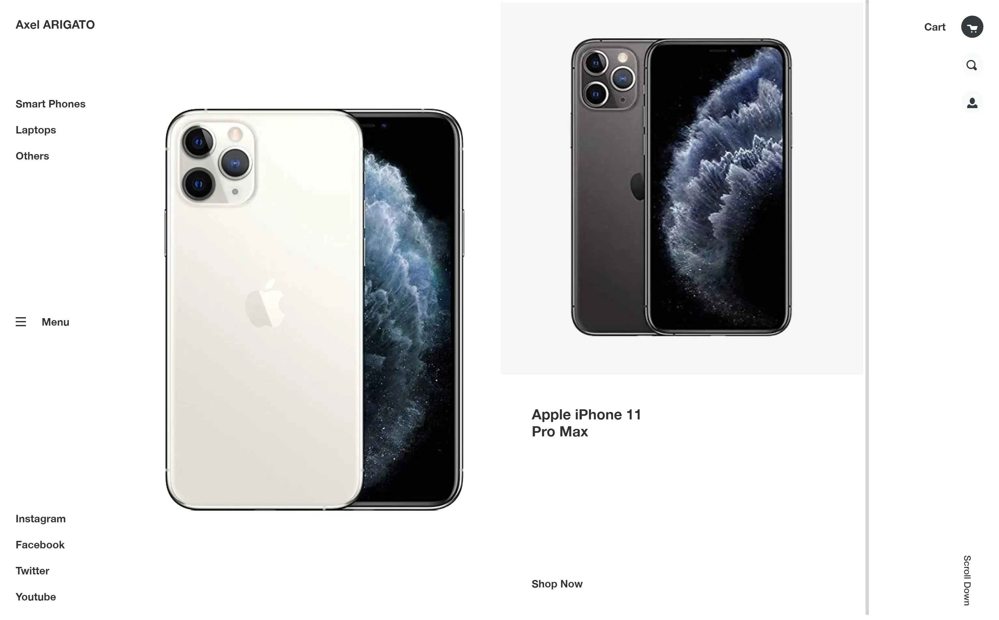
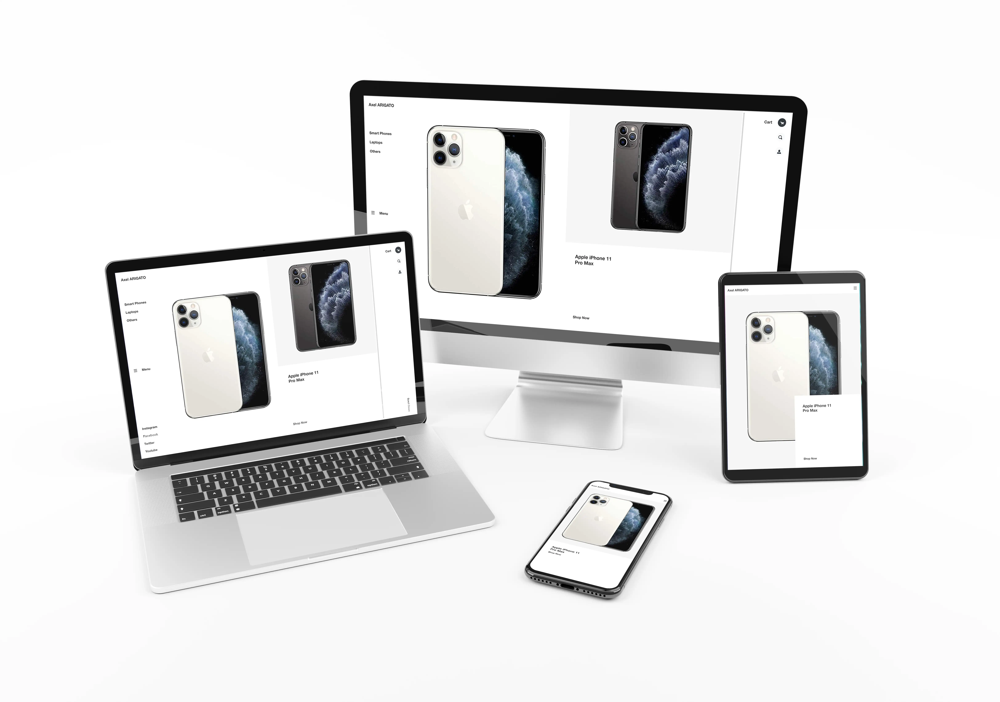
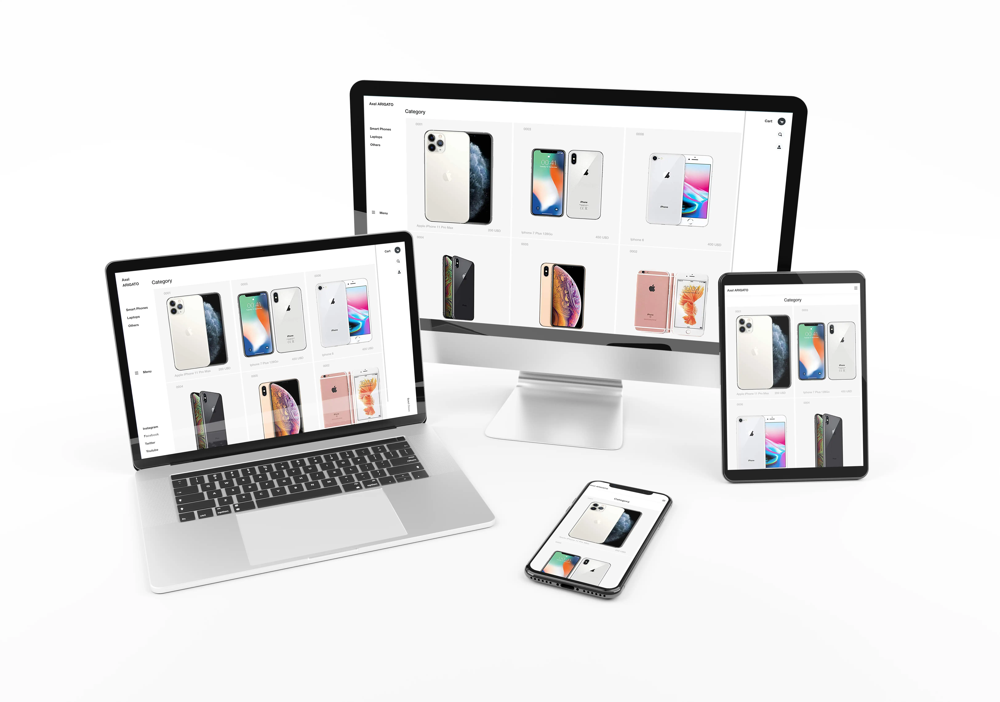
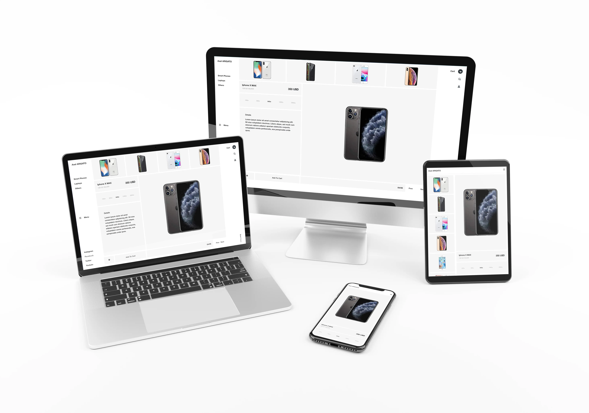

<!-- PROJECT LOGO -->

 

   <h3 align="center">Shop Website Template</h3>

  

    Website template converted from Design.
         
     
    ·
     <a href="https://rawcdn.githack.com/genzaraki/shoptemplate/6ff5415103285931859cb2c3c9888d6b305fe753/index.html">View Demo</a>
    ·  
  

 
<!-- TABLE OF CONTENTS -->
## Table of Contents

* [About the Project](#about-the-project)
  * [Built With](#built-with)
  * [ScreenShots](#built-with)
* [Contact](#contact)
* [Acknowledgements](#acknowledgements)

<!-- ABOUT THE PROJECT -->
## About The Project

  I've build this project according to a design and specifications received.  <a href="https://www.behance.net/gallery/80392909/AXEL-ARIGATO-Website">Design</a> idea by <a href="https://dribbble.com/oxygen_dima">Dmitry Oxygen</a> in Dribbble 

### Build With

* [Html]()
* [CSS]()
* [VSCODE]()

### ScreenSHots

 

 

 

### Contact
* Amadou - [@tigamadou](https://twitter.com/tigamadou) - [LinkedIn](https://www.linkedin.com/in/amadou-ibrahim-75769167) - [GitHub](https://github.com/genzaraki)

* Project Link [https://github.com/genzaraki/nwclone](https://github.com/genzaraki/nwclone)

### Acknowledgements

* [GitHub](https://github.com)
* [VSCODE]()
* [StyleLint]()
* [Stickler]()
